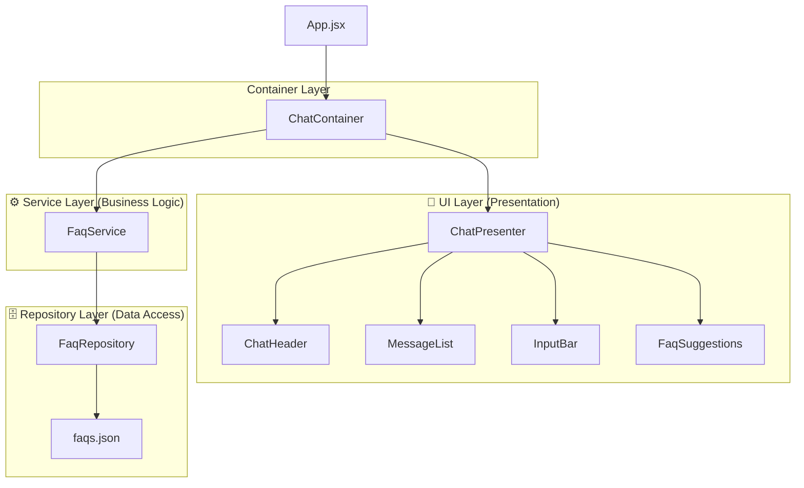

# UniFAQ React Chat

A modern React chat application implementing a three-layer modular architecture for FAQ management and user interaction.

## 🚀 Quick Start

### Prerequisites
- Node.js (v16 or higher)
- npm or yarn

### Installation & Running

1. **Install dependencies:**
   ```bash
   npm install
   ```

2. **Start the development server:**
   ```bash
   npm run dev
   ```
   Vite will print the local address `http://localhost:5000`. Open it in your browser to see the app.

3. **Build for production:**
   ```bash
   npm run build
   ```

4. **Preview production build:**
   ```bash
   npm run preview
   ```

## 🏗️ Architecture Overview

This application follows a **three-layer modular architecture** that separates concerns for better maintainability, testability, and scalability.

### Architecture Diagram



## 📁 Project Structure

```
src/
├── repositories/          # Data Access Layer
│   └── FaqRepository.js   # Handles FAQ data fetching
├── services/              # Business Logic Layer  
│   └── FaqService.js      # FAQ business operations
├── containers/            # Container Components
│   └── ChatContainer.jsx  # Business logic container
├── components/            # UI Components
│   ├── ChatPresenter.jsx  # Pure UI presenter
│   ├── ChatHeader.jsx     # Chat header component
│   ├── MessageList.jsx    # Message list component
│   ├── InputBar.jsx       # Input field component
│   └── FaqSuggestions.jsx # FAQ suggestions component
├── hooks/                 # Custom Hooks
│   └── useFaqSearch.jsx  # Legacy search hook
├── assets/                # Static Assets
│   ├── faqs.json         # Mock FAQ data
│   └── styles/           # CSS files
│       ├── App.css       # Global styles
│       └── index.css     # Base styles
├── App.jsx               # Root component
└── main.jsx             # Application entry point
```

## 🎯 Layer Responsibilities

### 🎨 UI Layer (Presentation)
- **Purpose**: Handle user interface and user interactions
- **Components**: React components that render UI elements
- **Responsibilities**:
  - Display data to users
  - Handle user input events
  - Manage component state for UI behavior
  - Render loading states and error messages

### ⚙️ Service Layer (Business Logic)
- **Purpose**: Implement business rules and data processing
- **Components**: Service classes
- **Responsibilities**:
  - Process and transform data
  - Implement search algorithms
  - Handle business rules and validation
  - Coordinate between UI and Repository layers

### 🗄️ Repository Layer (Data Access)
- **Purpose**: Handle data persistence and retrieval
- **Components**: Repository classes and data sources
- **Responsibilities**:
  - Fetch data from external sources
  - Handle data format conversion
  - Manage data access patterns
  - Abstract data source details from upper layers
